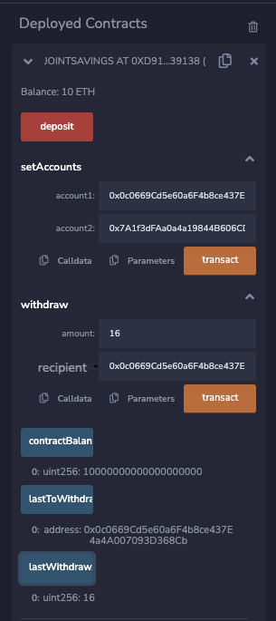
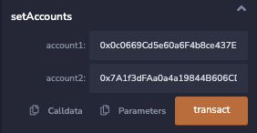
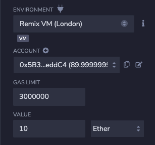
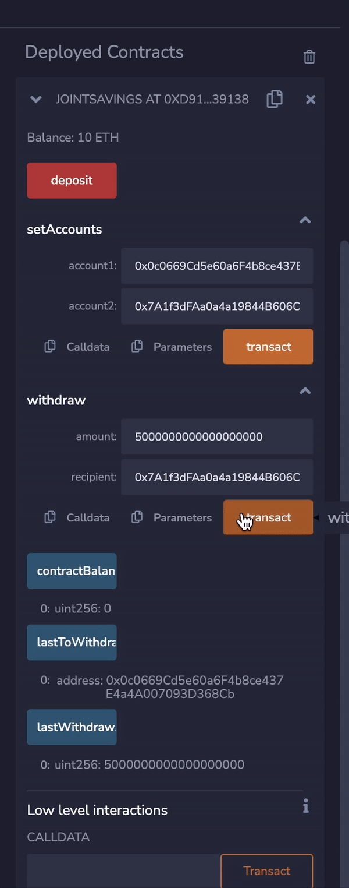

# Smart Contract Joint Savings Account - UW FinTech BootCamp Module 20 Challenge

This project is my Solidity smart contract that serves as a joint savings account between two Ethereum addresses. There is functionality to deposit, withdraw, set each account address, and validate that the correct addresses are used when calling the contract functions. 

---

## Summary

Using [Remix](https://remix.ethereum.org/), this smart contract can be compiled and deployed into an Ethereum VM that allows you to run each of its functions.

In the Remix UI you will first need to set each of the accounts that are a part of the joint account. 

Using the `deposit` function in Remix will fund the savings account.

With Ether in the savings account you can then use the smart contracts functions to withdraw Ether into each of the Ethereum accounts and then verify the balances of each account as well as which account was the last to withdraw. 

---

## Technologies

This is a Python 3.7 project ran using the following dependencies:
1. [Solidity](https://soliditylang.org/) (^0.5.0) - Smart contract development
2. [Remix](https://remix.ethereum.org/) - Solidity development environment

---

## Installation and Usage

To use this contract yourself you can simply upload the [joint_savings.sol](./joint_savings.sol) solidity smart contract to [Remix](https://remix.ethereum.org/). Select the "0.5.0+commit.1d4f565a" compiler to compile the smart contract and the "Remix VM (London)" to deploy the contract in your environment. 

---

## Contributors

[Ethan Silvas](https://github.com/ethansilvas)

---

## License

This project uses the [GNU General Public License](https://choosealicense.com/licenses/gpl-3.0/)